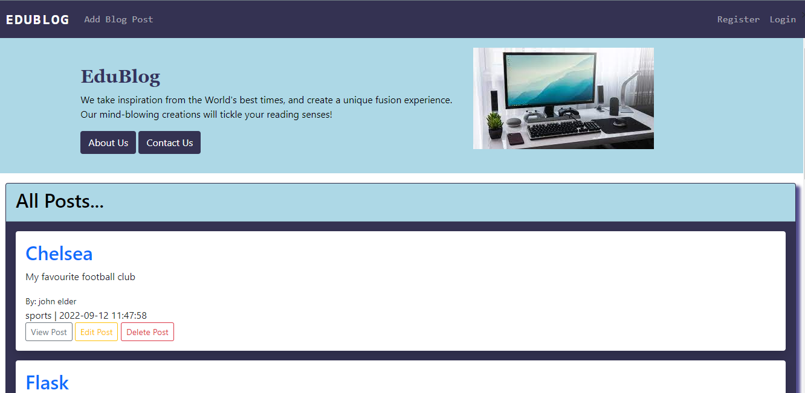
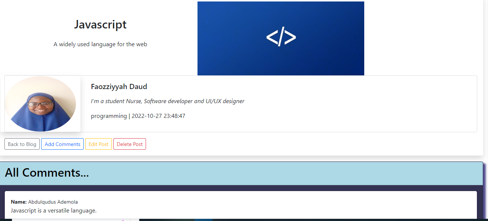
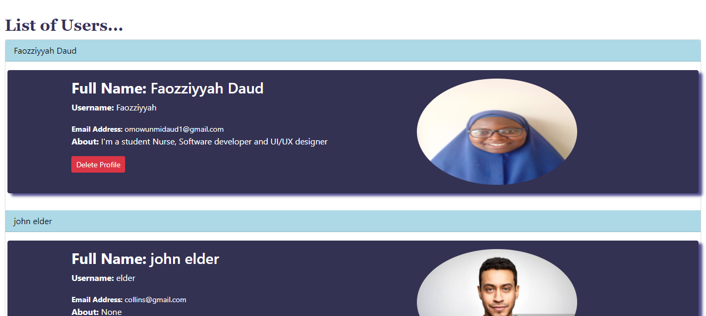

# Edublog

full stack CRUD blog website built with HTML, CSS, Bootstrap, Python, Postgres, and Flask framework. <br />


## Table of contents

- [Overview](#overview)
  - [The challenge](#the-challenge)
  - [Screenshot](#screenshot)
  - [Links](#links)
- [My process](#my-process)
  - [Built with](#built-with)
  - [What I learned](#what-i-learned)
  - [Useful resources](#useful-resources)
- [To use](#usage)

## Overview

### The challenge

Users should be able to:

- Add a post.
- View each post.
- Edit your post.
- Delete your post.
- Login as a user and logout.
- Update and delete your profile.
- View the optimal layout for the site depending on their device's screen size

### Screenshot






### Links

- Solution URL: (https://github.com/faozziyyah/flask-blog-app)
- Live link: (https://edulab-student-portal.herokuapp.com/)

## My process

### Built with

- HTML
- CSS
- Bootstrap
- [Flask](https://flask.palletsprojects.com/en/2.1.x/) - A web development microframework built with python
- Postgres

### What I learned

- Authentication and authorization
- How to use the Rich Text Editor

```Python
@app.route('/')
def index():
    flash("Welcome to our website!")
    posts = Post.query.order_by(Post.date_posted)
    return render_template('index.html', post=posts)
```

```HTML


    <div class="post mb-3 p-3 shadow bg-body rounded">
      <h2><a href="{{ url_for('post', id=postdetail.id) }}">{{ postdetail.title }}</a> </h2>
      <p>{{ postdetail.content|safe }}</p>
      <small>By: {{ postdetail.poster.name }}</small> <br />     
      {{ postdetail.slug }} | {{ postdetail.date_posted }} <br />
      <a href="{{ url_for('post', id=postdetail.id) }}" class="btn btn-outline-secondary btn-sm">View Post</a>
    </div>

```

### Useful resources

- [Flask](https://flask.palletsprojects.com/en/2.1.x/) - A web development microframework built with python
- [Postgresql](https://www.postgresql.org/) - The world's most popular open source database
- [MySQL](https://www.mysql.com/) - The world's most popular open source database
